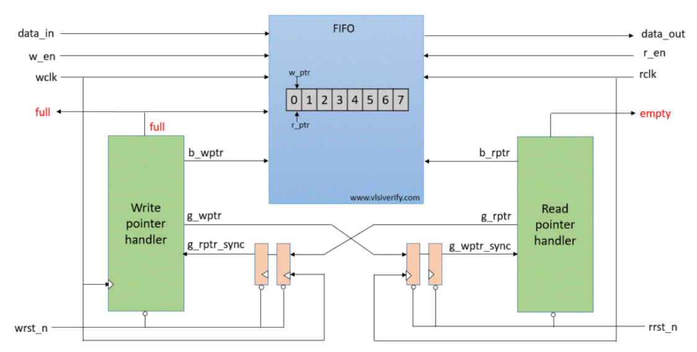
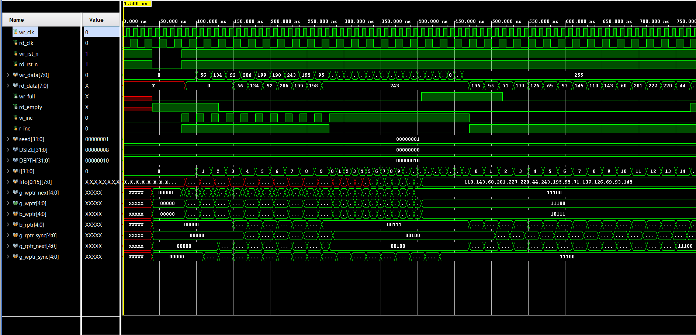
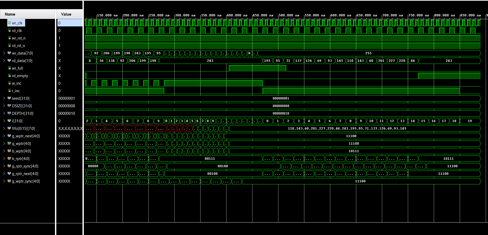

# Async FIFO in Verilog

This project implements an asynchronous FIFO in Verilog with separate write and read clock domains. The design uses Gray-coded pointers plus two-stage synchronizers to safely pass status information across clock boundaries.

The project is set up in `Vivado v2022.2` and includes a behavioral testbench for write, read, full, and empty scenarios.

## Features

- Independent write and read clocks
- Gray-code pointer synchronization between clock domains
- Full detection in the write domain
- Empty detection in the read domain
- Parameterized FIFO depth and data width
- Vivado/XSim behavioral simulation setup

## Top-Level Ports

| Signal | Direction | Description |
| --- | --- | --- |
| `wr_clk` | Input | Write clock |
| `wr_rst_n` | Input | Active-low write reset |
| `rd_clk` | Input | Read clock |
| `rd_rst_n` | Input | Active-low read reset |
| `wr_en` | Input | Write enable |
| `rd_en` | Input | Read enable |
| `data_in` | Input | Write data bus |
| `data_out` | Output | Read data bus |
| `full` | Output | FIFO full flag |
| `empty` | Output | FIFO empty flag |

## Default Parameters

| Parameter | Default | Description |
| --- | --- | --- |
| `DEPTH` | `16` | Number of FIFO entries |
| `DATA_WIDTH` | `8` | Data bus width |
| `PTR_WIDTH` | `$clog2(DEPTH) + 1` | Pointer width including wrap bit |

## Architecture

The FIFO is divided into small modules:

- `TOP.v`: connects all submodules
- `sync.v`: two-flop synchronizer for Gray-coded pointers
- `wrptr_full.v`: write pointer generation and full detection
- `rdptr_empty.v`: read pointer generation and empty detection
- `fifo_mem.v`: storage array
- `Async_FIFO_tb.v`: behavioral testbench

### Block Diagram



This diagram matches the structure used in the project:

- The write side maintains `b_wptr` and `g_wptr`
- The read side maintains `b_rptr` and `g_rptr`
- Gray-coded pointers are synchronized into the opposite clock domain
- Full and empty are generated locally from synchronized pointer values

## Repository Structure

```text
.
|-- README.md
|-- Async_FIFO.xpr
|-- Async_FIFO_tb_behav.wcfg
|-- Async_FIFO.srcs
|   |-- sources_1/new
|   |   |-- TOP.v
|   |   |-- sync.v
|   |   |-- wrptr_full.v
|   |   |-- rdptr_empty.v
|   |   `-- fifo_mem.v
|   `-- sim_1/new
|       `-- Async_FIFO_tb.v
`-- docs/images
    |-- fifo-architecture.png
    |-- waveform-overview.png
    `-- waveform-detail.png
```

## Simulation

### Vivado GUI

1. Open `Async_FIFO.xpr` in Vivado 2022.2.
2. Select `Async_FIFO_tb.v` as the simulation top.
3. Run Behavioral Simulation.
4. Load `Async_FIFO_tb_behav.wcfg` if the waveform view does not open automatically.

### XSim Batch Scripts

Vivado generated batch files are available under `Async_FIFO.sim/sim_1/behav/xsim`:

```bat
cd Async_FIFO.sim\sim_1\behav\xsim
compile.bat
elaborate.bat
simulate.bat
```

The TCL simulation script runs the testbench for `1000 ns`.

## Testbench Scenarios

The included testbench covers:

1. Writing data and reading it back
2. Filling the FIFO and attempting extra writes
3. Emptying the FIFO and attempting extra reads

Clock settings in the current testbench:

- `wr_clk` period: `10 ns`
- `rd_clk` period: `20 ns`

## Waveform Results

### Overview



This waveform shows the main FIFO behavior:

- reset is asserted and released before traffic starts
- write transactions load several values into the FIFO
- read transactions return the stored values in order
- `wr_full` asserts when the FIFO reaches capacity
- `rd_empty` asserts after the stored data is drained

### Detailed Behavior



This view makes the pointer activity easier to inspect:

- binary and Gray-coded pointers advance in their local clock domains
- synchronized Gray pointers lag by the expected synchronizer delay
- the full and empty flags change based on synchronized pointer comparisons

## Notes

- The FIFO memory currently uses a combinational read path in `fifo_mem.v`.
- Both resets are active-low.
- The top-level module in this project is `TOP`.

## Future Improvements

- Add randomized stress testing
- Add self-checking scoreboarding in the testbench
- Add synthesis and implementation result snapshots
- Replace the reference block diagram with a project-specific diagram if needed
